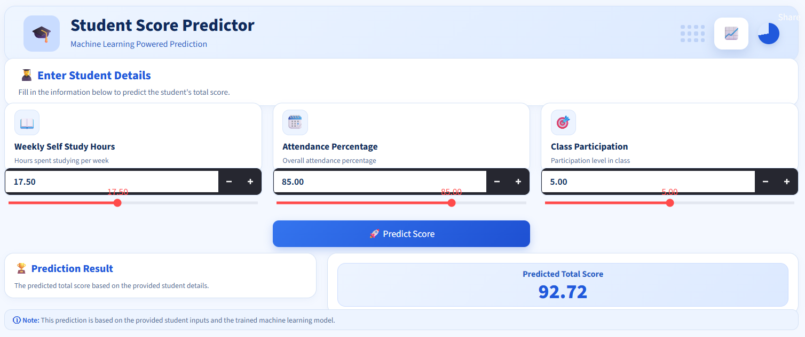

# Student Score Prediction

##  Project Overview

This project predicts a student's total score based on:

- Weekly self-study hours
- Attendance percentage
- Class participation

A Decision Tree Regressor model is used to predict the student's total score.
##  Features

- Predicts student performance using a trained Machine Learning model
- Interactive Streamlit web interface
- Simple and user-friendly input form
- Real-time prediction
- Trained model loaded using Joblib
- Deployed online using Streamlit Community Cloud
## How It Works

1. User enters the required student details.
2. The input data is passed to the trained Machine Learning model.
3. The Decision Tree Regressor processes the input features.
4. The model predicts the student's score.
5. The predicted score is displayed in the Streamlit application.
##  Tech Stack

- **Python** — Programming language
- **Pandas** — Data handling
- **NumPy** — Numerical operations
- **Scikit-learn** — Machine Learning
- **Joblib** — Model saving and loading
- **Streamlit** — Web application
- **Git & GitHub** — Version control and code hosting
##  Model Performance

The final Decision Tree Regressor was evaluated on the test dataset using standard regression metrics. 

Metric= MAE     MSE      RMSE       R² 
Score= 6.1089   67.3459  8.2065    0.7171

### Interpretation

- **MAE:** The model's average absolute prediction error is approximately **6.11 score points**.
- **RMSE:** The RMSE is approximately **8.21 score points**.
- **R²:** The model explains approximately **71.71% of the variance** in the target score.
##  Run Locally

### 1. Clone the repository

git clone https://github.com/princeyadav639/Student-score-prediction.git

### 2. Navigate to the project directory

cd Student-score-prediction

### 3. Create a virtual environment

python -m venv .venv

### 4. Activate the virtual environment

.venv\Scripts\activate

### 5. Install the required dependencies

pip install -r requirements.txt

### 6. Run the Streamlit application

streamlit run app.py
##  Project Structure

```text
student-score-prediction/
│
├── model/
│   └── student_score_model.pkl
│
├── screenshots/
│   └── app.png
│
├── app.py
├── requirements.txt
├── README.md
└── .gitignore
```

##  Live Demo

You can try the deployed application here:

=> https://student-score-prediction-9jdywpztu4xyq3tspdiswd.streamlit.app/

The application is deployed using Streamlit Community Cloud.

##  Screenshot

